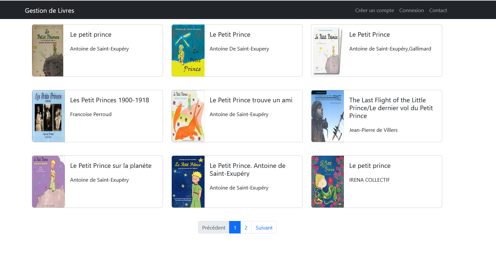

# Library Manager
Site web permettant la gestion de livre 

## 🚀 Fonctionnalités

- Rechercher des livres
- Création de compte utilisateur pour gérer ça bibliothéque
- Ajouter, noter et suivre l'avancement des livres
- Sauvegarde des données des utilisateurs dans la base de données MariaDB

## 🛠️ Technologies utilisées

- Frontend : Angular(TypeScript)
- Backend : Spring Boot(Java)
- Base de données : MariaDb
- Api externe: OpenLibrary (https://openlibrary.org/)

## Images

